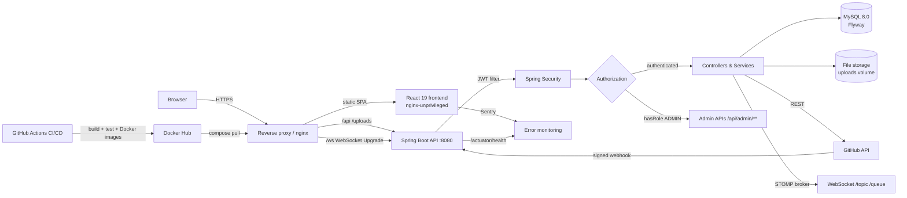
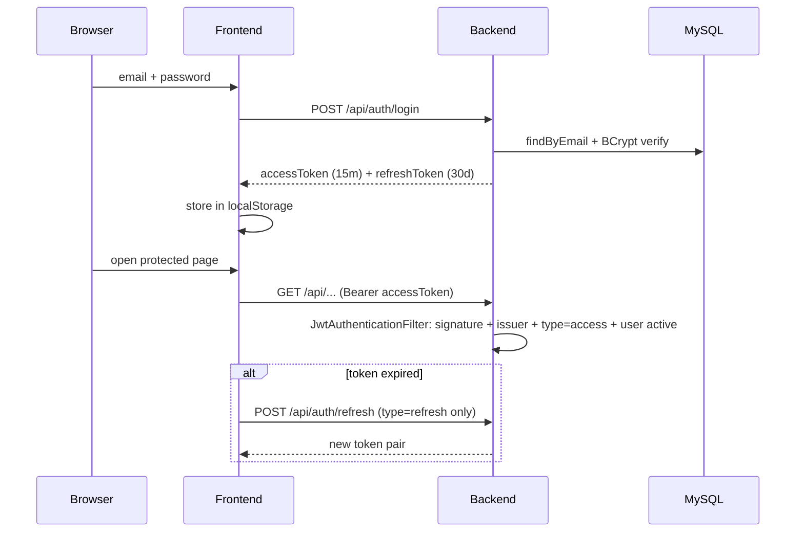
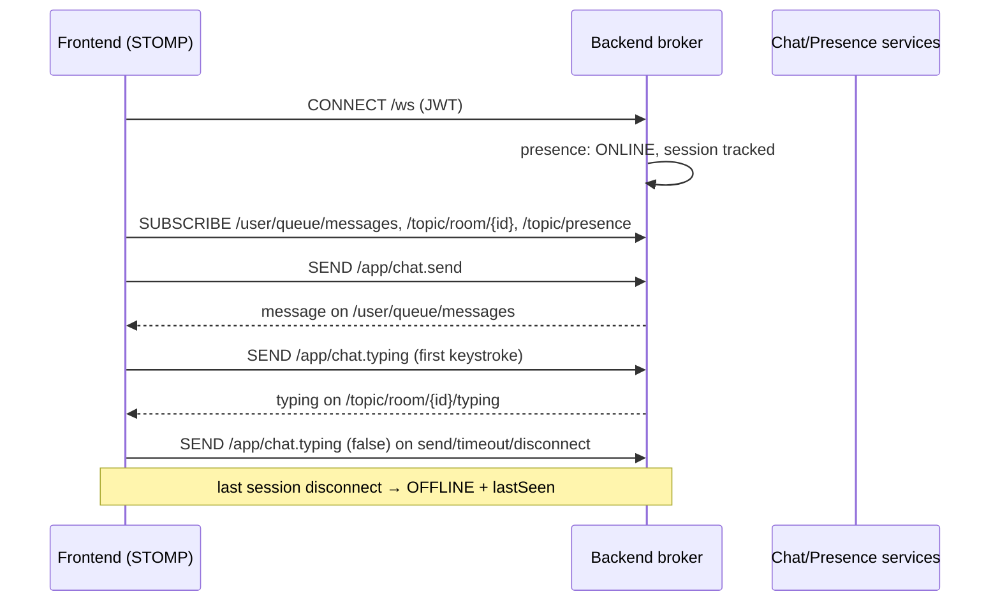
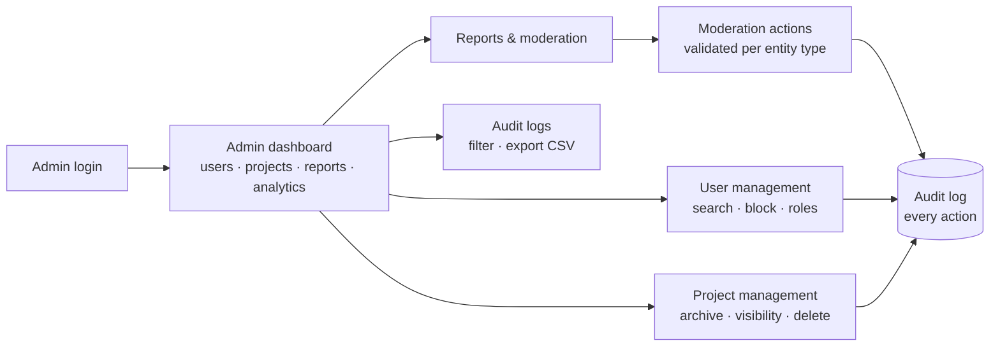
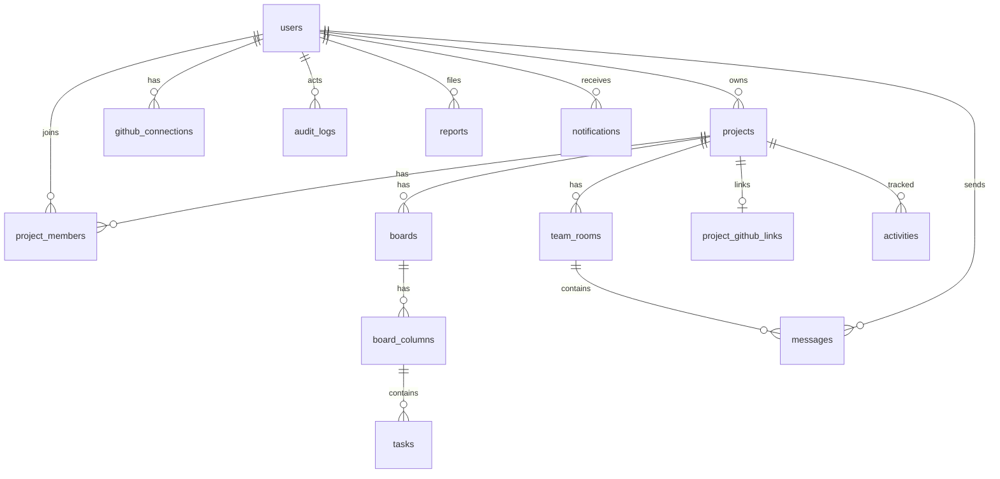

<div align="center">
  
  
  
  
  
  <br>
  
</div>

<h1 align="center">🚀 DevSync</h1>

<p align="center">
  Developer Collaboration Platform — Kanban boards, team chat, project management, real-time notifications, admin moderation, and GitHub integration.
</p>

## 📖 Overview

DevSync is a full-stack developer collaboration platform built to production standards:
JWT + OAuth2 authentication, real-time chat and presence over WebSocket/STOMP, Kanban
project management, a social feed, role-based team access, admin moderation with audit
logging, analytics, and GitHub repository integration. The backend is Spring Boot 3.4
with MySQL and Flyway migrations; the frontend is React 19 + TypeScript + Vite, deployed
behind nginx. CI/CD runs via GitHub Actions, and the whole stack ships as Docker images.

## ✨ Features

🔐 JWT + OAuth2 (GitHub/Google) · OTP email verification · per-IP rate limiting · BCrypt
📋 Kanban boards with drag-drop tasks, labels, priorities, due dates, filters
💬 WebSocket real-time chat, team rooms & DMs, typing indicators, presence
👥 Projects, invitations, join requests, role-based access (Owner/Admin/Member)
🛡️ Admin suite: users, projects, reports & moderation, activity, audit logs, analytics
📊 Analytics: admin/platform metrics, project stats, user contribution heatmaps
🔗 GitHub integration: OAuth connect, repo linking, commits/issues/PRs, signed webhooks
📎 Secure file uploads (magic-byte validation, no executables), pinned projects, bookmarks
🔔 Notifications for invitations, join requests, mentions, role changes
📡 Social feed, search, user profiles, global search

## 🛠️ Tech Stack

| Layer | Technology |
|-------|-----------|
| Backend | Java 21, Spring Boot 3.4, Spring Security, Spring Data JPA, WebSocket (STOMP) |
| Database | MySQL 8.0, Flyway migrations, H2 for tests |
| Auth | JWT (jjwt), OAuth2 (GitHub/Google), OTP email codes, BCrypt |
| Frontend | React 19, TypeScript 5, Vite, Tailwind CSS 4, shadcn/ui, Framer Motion, Recharts |
| Realtime | STOMP over WebSocket, SockJS fallback |
| Infra | Docker, nginx (reverse proxy + SPA), GitHub Actions CI/CD, JaCoCo coverage, Sentry (frontend) |

## 🏗️ Architecture



- **Stateless JWT** authentication: the filter validates signature + expiry + issuer +
  token type; every request reloads the user so blocked/deleted accounts are rejected
  immediately.
- **WebSocket** broker topics for chat, typing, and presence; presence tracks sessions
  so closing one tab doesn't flip a user offline.
- **Admin APIs** are enforced server-side (`/api/admin/**` → `ROLE_ADMIN`); the frontend
  guard is UX-only.

## 🔐 Authentication Flow



- OAuth2 (GitHub/Google) is server-side: `/oauth2/authorization/{provider}` →
  `/login/oauth2/code/{provider}` → JWT pair in the URL fragment (never in server logs).
- OTP login: `/auth/otp/send` (rate-limited, silent on unknown emails) →
  `/auth/otp/verify` (5-attempt lockout, constant-time compare).
- Blocked/deleted accounts cannot log in, refresh, or authenticate requests.

## 📡 WebSocket Flow



## 🛡️ Admin Flow



- Last-admin protection: an admin cannot be blocked/demoted/deleted if they are the
  last active admin; admins cannot modify themselves.
- Every moderation/admin action writes exactly one audit entry with actor, target,
  action, status, IP/device/browser, and details — never secrets.

## 🔗 GitHub Integration

See the **GitHub Integration** section in this README (below) — OAuth connect with
encrypted tokens, repo linking, commits/issues/PRs, signed idempotent webhooks.

## 🗄️ Database (key relationships)



All schema changes flow through Flyway migrations (`backend/src/main/resources/db/migration/`)
— never edit an applied migration; add `V{n+1}__...`.

## 🚀 Local Setup

**Prerequisites:** Java 21, Maven, Node 20+ (or Bun), MySQL 8.

```bash
# 1. Database
mysql -u root -p -e "CREATE DATABASE IF NOT EXISTS dev;"

# 2. Backend (http://localhost:8080)
cd backend
export JWT_SECRET='dev-only-secret-at-least-32-bytes-long'
export MYSQL_PASSWORD='your-mysql-password'
mvn spring-boot:run

# 3. Frontend (http://localhost:5173)
cd frontend
bun install
bun run dev
```

## 🐳 Docker Setup

```bash
cp .env.example .env        # fill in JWT_SECRET, MYSQL_ROOT_PASSWORD, MYSQL_PASSWORD
docker compose up -d --build
curl -fsS http://localhost/api/health
```

Production architecture, healthchecks, backup/restore, and troubleshooting:
**👉 [docs/PRODUCTION.md](docs/PRODUCTION.md)**.

## 🔑 Environment Variables

| Variable | Required | Description |
|----------|----------|-------------|
| `JWT_SECRET` | **Yes** | 256-bit+ JWT signing secret (`openssl rand -base64 64`) |
| `MYSQL_PASSWORD` | **Yes** | Password for the `devsync` DB user |
| `MYSQL_ROOT_PASSWORD` | Compose | MySQL root password |
| `DEVSYNC_CORS_ORIGINS` | No | Allowed frontend origins |
| `DEVSYNC_TRUST_X_FORWARDED_FOR` | No | `true` only behind your own proxy |
| `DEVSYNC_ADMIN_SEED_ENABLED/_EMAIL/_PASSWORD` | No | Opt-in bootstrap admin |
| `MAIL_USERNAME` / `MAIL_PASSWORD` | For OTP | SMTP credentials |
| `GITHUB_CLIENT_ID` / `GITHUB_CLIENT_SECRET` | For OAuth/GitHub | GitHub OAuth app |
| `GOOGLE_CLIENT_ID` / `GOOGLE_CLIENT_SECRET` | For OAuth | Google OAuth app |
| `GITHUB_WEBHOOK_SECRET` | For webhooks | HMAC secret for GitHub webhooks |
| `GITHUB_TOKEN_ENCRYPTION_KEY` | No | Encrypts GitHub tokens (falls back to `JWT_SECRET`) |
| `UPLOAD_DIR` / `UPLOAD_MAX_SIZE` | No | Upload location / max bytes |
| `DEVSYNC_JWT_ACCESS_EXPIRATION_MS` | No | Access-token lifetime (default 15 min) |
| `DEVSYNC_JWT_REFRESH_EXPIRATION_MS` | No | Refresh-token lifetime (default 30 days) |
| `DEVSYNC_COOKIE_SECURE` | **Yes (prod)** | `true` behind HTTPS — refresh cookie `Secure` |
| `DEVSYNC_WS_RATE_LIMIT_ENABLED/_MAX_MESSAGES/_MAX_SUBSCRIPTIONS` | No | Per-user WebSocket rate limits |
| `VITE_API_URL` (build arg) | No | Frontend API base URL — default `/api` (same-origin) |
| `VITE_WS_URL` (build arg) | No | Frontend WebSocket URL — default `/ws` (same-origin) |

> **Frontend URLs**: the production bundle is built with same-origin paths
> (`VITE_API_URL=/api`, `VITE_WS_URL=/ws`) and the nginx container proxies both
> to the backend, so no hostname is hardcoded and `ws`/`wss` is derived from the
> page protocol. Local development uses `frontend/.env.development`
> (`http://localhost:8080/api` / `http://localhost:8080/ws`). To serve the API
> from a separate host, override the Docker build args:
> `VITE_API_URL=https://api.example.com/api` `VITE_WS_URL=wss://api.example.com/ws`.
> Set `DEVSYNC_CORS_ORIGINS` to your production origin(s) so the backend accepts
> browser traffic and WebSocket handshakes from that domain.

> **Auth model**: access tokens are short-lived (15 min) JWTs; refresh tokens are
> HttpOnly SameSite cookies scoped to `/api/auth`, rotated on every use, revoked on
> logout, and invalidated immediately when an account is blocked/deleted. File
> downloads go through the authenticated `/api/attachments/{id}/download` endpoint
> (project-membership enforced) — there is no public `/uploads` URL.

## 🧪 Testing

```bash
# Backend (unit + MockMvc + full-context integration with H2)
cd backend && mvn test

# Backend coverage report
cd backend && mvn test -Pcoverage && mvn jacoco:report   # target/site/jacoco

# Frontend (routes, admin guard, auth context, typing hook, pages)
cd frontend && npx vitest run
```

Coverage: ~68% instruction / 71% line overall; security, auth, admin, reports, GitHub,
analytics, activity/audit, and moderation flows have integration-level tests.

## 🚢 Deployment

- **CI** (`.github/workflows/ci.yml`): auth unit tests → backend integration against
  MySQL with coverage → frontend typecheck/lint/build → Docker image builds.
- **CD** (`.github/workflows/cd.yml`): runs only after CI succeeds (`workflow_run`),
  pushes images tagged by commit SHA; tag pushes (`v*`) trigger the SSH deploy.

## 📸 Screenshots

Place screenshots in `docs/screenshots/` and link them here. Suggested captures:
landing → auth → dashboard → project board → chat → notifications → admin
dashboard → audit logs. (Section intentionally left empty — the repo contains
no placeholder images.)

---

## 🔗 GitHub Integration (details)

**Architecture**

```
Browser ──GET /api/github/auth-url──▶ backend (state bound to user, 10 min TTL)
   │                                   │
   └──▶ GitHub OAuth (scope: repo, read:user) ──code──▶ /api/github/callback
                                                        │
                              exchange code ──▶ access token
                              encrypt (AES-256-GCM) ──▶ github_connections table
                              redirect ──▶ /settings?github=connected

Project linking:  POST /api/github/projects/{id}/link  (owner/admin only)
                  stores metadata only (project_github_links), sets project.repositoryUrl

Repo data:        GET /api/github/projects/{id}/commits|issues|pulls  (members)
                  GitHub is called ONLY when the tabs are opened (60s repo-list cache)

Webhooks:         POST /api/webhooks/github  (X-Hub-Signature-256 verified,
                  idempotent by X-GitHub-Delivery) → records project activity on push
```

**Security:** OAuth2 only — no passwords, no token paste. Access tokens are encrypted
at rest (AES-GCM, key from `GITHUB_TOKEN_ENCRYPTION_KEY` or `JWT_SECRET`), never
returned by any API, and never logged. The callback is bound to the starting user via
a single-use, expiring `state`. Webhook payloads are rejected unless the HMAC-SHA256
signature matches `GITHUB_WEBHOOK_SECRET`.

**Setup:** create a GitHub OAuth App (callback `http://localhost:8080/api/github/callback`),
set the env vars, and open a project's **GitHub** tab to connect and link a repository.

## 🧭 Interview Preparation

See **👉 [INTERVIEW_GUIDE.md](INTERVIEW_GUIDE.md)** — architecture decisions, security
design, scaling answers, and trade-offs, written as interviewer Q&A.
